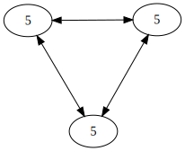

!SLIDE

# What is Eventual Consistency?

!SLIDE

Replicas are _not_ updated
atomically, but eventually
converge.

!SLIDE smbullets

# Why?

* Availability
* Latency
* Durability
* Operational Ease

!SLIDE full-page

!SLIDE full-page

CC BY-ND 2.0
CTA Web
